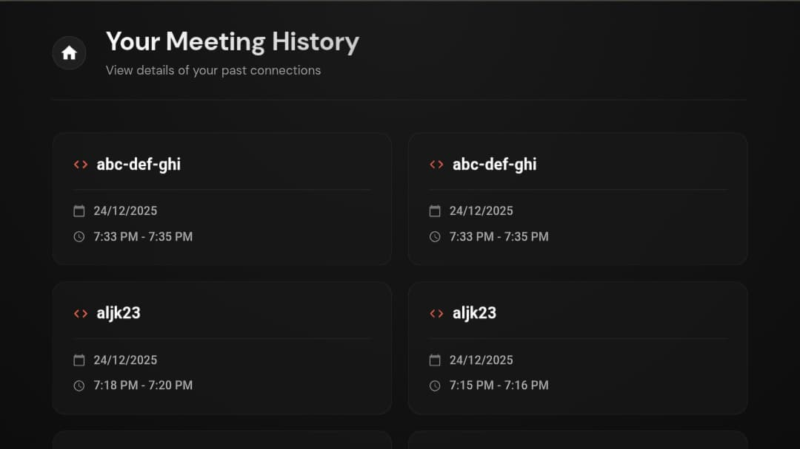

# 🎥 OmniMeet – Real-Time Video Conferencing Platform

  
  
  
  
  

  <h3>
    <a href="https://omnimeet-app.onrender.com">🔴 View Live Demo</a>
  </h3>

---

## 🚀 Overview

**OmniMeet** is a production-grade, full-stack video conferencing application engineered to facilitate seamless real-time communication. Built with a focus on low latency and high availability, it enables users to create instant meetings, join via secure codes, and collaborate using HD video, crystal-clear audio, and real-time chat.

This project demonstrates advanced proficiency in **Full-Stack Development**, **WebRTC Mesh Architecture**, and **WebSocket Networking**.

---

## 🌟 Key Features

* **⚡ Real-Time Video & Audio**
    * High-quality, low-latency streaming using **WebRTC** peer-to-peer protocols.
    * Mesh architecture ensures direct data transfer between users for maximum security.

* **💬 Instant Chat & Collaboration**
    * Integrated real-time messaging system powered by **Socket.io**.
    * Zero-delay message delivery with visual notifications.

* **🔒 Enterprise-Grade Security**
    * **JWT Authentication:** Stateless, secure user sessions.
    * **Bcrypt Hashing:** Industry-standard encryption for user credentials.
    * **Secure Sockets:** Middleware authentication prevents unauthorized connection attempts.

* **📅 Smart Meeting History**
    * Persistent tracking of past meetings, timestamps, and activity logs stored in **MongoDB**.
    * Dashboard view to revisit previous connection details.

* **📱 Fully Responsive Design**
    * Adaptive UI that scales perfectly from 4K Desktops to Mobile devices.
    * Custom mobile navigation and touch-friendly controls.

* **🎛️ Advanced Media Controls**
    * Dynamic toggling of Audio, Video, and Screen Sharing capabilities.
    * "Lobby Mode" allows users to preview video/audio before joining.

---

## 🛠️ Tech Stack

| Domain | Technologies Used |
| :--- | :--- |
| **Frontend** | React.js, Vite, Material UI (MUI), React Router DOM, Context API |
| **Backend** | Node.js, Express.js, Socket.io (Signaling Server) |
| **Database** | MongoDB Atlas (Cloud), Mongoose ORM |
| **Core** | WebRTC (Peer-to-Peer), JWT, Bcrypt.js, REST APIs |
| **DevOps** | Render (Cloud Deployment), Git/GitHub |

---

## 📸 Application Screenshots

| **Landing Page** | **Home Page** |
|:---:|:---:|
|  |  |
| *Modern, responsive landing interface* | *Real-time video grid with controls* |

 

| **Meeting Room** | **Meeting History** |
|:---:|:---:|
|  |  |
| *Optimized for smaller screens* | *Persistent logs of past activities* |

---

  
  **Created by Brijesh RAkholiya**
  
  [LinkedIn](https://linkedin.com/in/brijeshrakholiya17) • [GitHub](https://github.com/brijeshrakholiya17) • [Email](mailto:brijeshrakholiya001@gmail.com)

